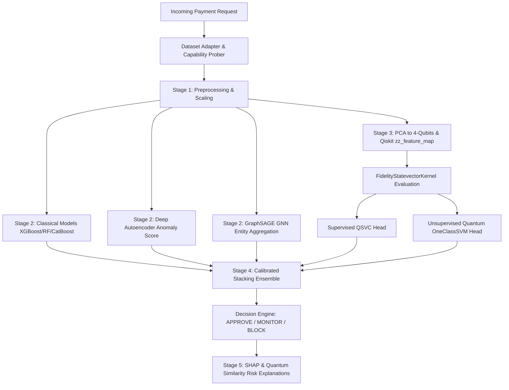

# Q-FraudShield: Quantum-Enhanced Digital Payment Fraud Intelligence

> **Qiskit Fall Fest 2026 Hackathon Prototype**  
> *Hybrid Classical AI + Deep Learning + Graph Intelligence + Qiskit 2.x Quantum Kernel Feature Representation*

---

## 🚀 Quick Start (One Command Run)

### 1. Install & Train All Models
```bash
# Clone and navigate to root directory
cd Q-FraudShield_Hackathon_Ready

# Run setup script (installs dependencies, generates synthetic data, trains all models)
bash scripts/setup.sh
```

### 2. Start Backend Server (FastAPI)
```bash
python -m uvicorn backend.app.main:app --reload --port 8000
```
- API Health & Capabilities Probe: `http://localhost:8000/api/health`
- Interactive OpenAPI Docs: `http://localhost:8000/docs`

### 3. Start Frontend Dashboard (React + Vite)
```bash
cd frontend
npm run dev
```
- Open UI: `http://localhost:5173`

---

## 🏗 System Architecture



---

## ⚛ Quantum Methodology (Qiskit 2.x API)

- **Qiskit Version**: `qiskit>=2.1`, `qiskit-machine-learning>=0.9.1`.
- **Feature Map**: Pluggable `zz_feature_map(feature_dimension=4, reps=2, entanglement='linear')` function (class `ZZFeatureMap` deprecated since 2.1).
- **Quantum Kernel**: `FidelityStatevectorKernel` computing symmetric, positive semi-definite (PSD) kernel matrices with diagonal elements equal to `1.0`.
- **Quantum Heads**:
  - **Supervised QSVC**: `SVC(kernel="precomputed")` fit on quantum fidelity matrix.
  - **Unsupervised Anomaly**: `OneClassSVM(kernel="precomputed")` fit on legitimate-only quantum state vectors.
- **Fair Benchmark**: Quantum QSVC is evaluated against classical `RBF-SVM` and `XGBoost` trained on the **exact same 600-sample stratified subset** and **exact same 4-qubit PCA features**.
- **Execution Labeling**: All quantum results are strictly labeled **SIMULATION** (Qiskit Aer simulator).

---

## 🌟 End-to-End Product Flow

1. **CHECK A PAYMENT (`/`)**: Instant payment safety assessment with multimodal OCR, QR extraction, and Gemini visual consistency verification.
2. **INVESTIGATION CENTER (`/investigation`)**: Unified case workspace connecting entity profiles, chronological timelines, and analyst audit actions.
3. **FRAUDDNA & SHAP (`/explain`)**: Evidence-grounded feature attribution and counterfactual scenario modeling.
4. **ATTACK CHAIN (`/chain`)**: Chronological forensic reconstruction tracing phishing origins, execution attempts, and intervention breakpoints.
5. **INTERACTIVE FRAUD GRAPH (`/graph`)**: WebGL 3D/2D topological relationship graph exposing syndicate mule clusters.
6. **RESPONSE CENTER + REPORT & RECOVER (`/response`)**: Dynamic, evidence-grounded action playbooks, downloadable 11-section forensic dossiers, and human analyst override workflows.
7. **COPILOT AI (`/copilot`)**: Conversational fraud analyst assistant answering grounded queries with zero hallucinations.

---

## 🧪 Automated Testing

```bash
# Run full automated test suite (80/80 tests)
python -m pytest
```

---

## 📊 Evaluation Protocols & Honesty Disclaimers

1. **No Fabricated Metrics**: Every number rendered in the UI comes directly from model inference and evaluation scripts.
2. **No Claim of Quantum Advantage**: We state plainly that classical gradient boosting outperforms quantum kernel simulations on classical tabular datasets under NISQ limitations. Quantum analysis is presented as selective advanced feature projection.
3. **Evidence Grounding**: Gemini visual assessments are probabilistic (`LOW INDICATION`, `MODERATE INDICATION`, `HIGH INDICATION`) and act as evidence inputs to the authoritative Risk Fusion Engine.
4. **Synthetic Data Disclosure**: Payment streaming uses synthetic distributions clearly marked **[DEMO / SYNTHETIC]**.
5. **Non-Overclaiming Response**: All response actions are presented as recommendations (`RECOMMENDED`, `USER ACTION`, `SIMULATED`, `EXTERNAL ACTION`). Q-FraudShield does not claim direct banking control without authorized banking API integrations.

---

## 🔗 Key API Endpoints

| Endpoint | Method | Description |
| :--- | :---: | :--- |
| `/api/health` | GET | Package capability probes & system status |
| `/api/check-payment` | POST | Unified multimodal payment forensics & risk fusion |
| `/api/investigation/cases` | GET | List & search indexed investigation cases |
| `/api/investigation/cases/{id}` | GET | Complete unified case dossier |
| `/api/investigation/cases/{id}/attack-chain` | GET | Chronological attack story reconstruction |
| `/api/investigation/cases/{id}/response` | GET | Response Center recommendations & playbook |
| `/api/investigation/cases/{id}/report` | GET | 11-section forensic report dossier |
| `/api/investigation/cases/{id}/analyst-decision` | POST | Human analyst review & override submission |
| `/api/copilot/chat` | POST | Evidence-grounded AI analyst conversation |
| `/api/graph/case/{id}` | GET | Isolated entity subgraph |

---

## 📚 References

1. Havlicek, V., Córcoles, A.D., Temme, K. et al. *Supervised learning with quantum-enhanced feature spaces*. Nature 567, 209–212 (2019).
2. Grossi, M. et al. *Mixed Quantum-Classical Machine Learning Pipeline for Credit Card Fraud Detection*. IEEE Transactions on Quantum Engineering (2022).
3. Kyriienko, O., & Magnusson, E. *Quantum Kernels for Real-World Fraud Detection Datasets*. arXiv:2208.01203 (2022).
4. Qiskit Machine Learning Documentation (v0.9.1).

