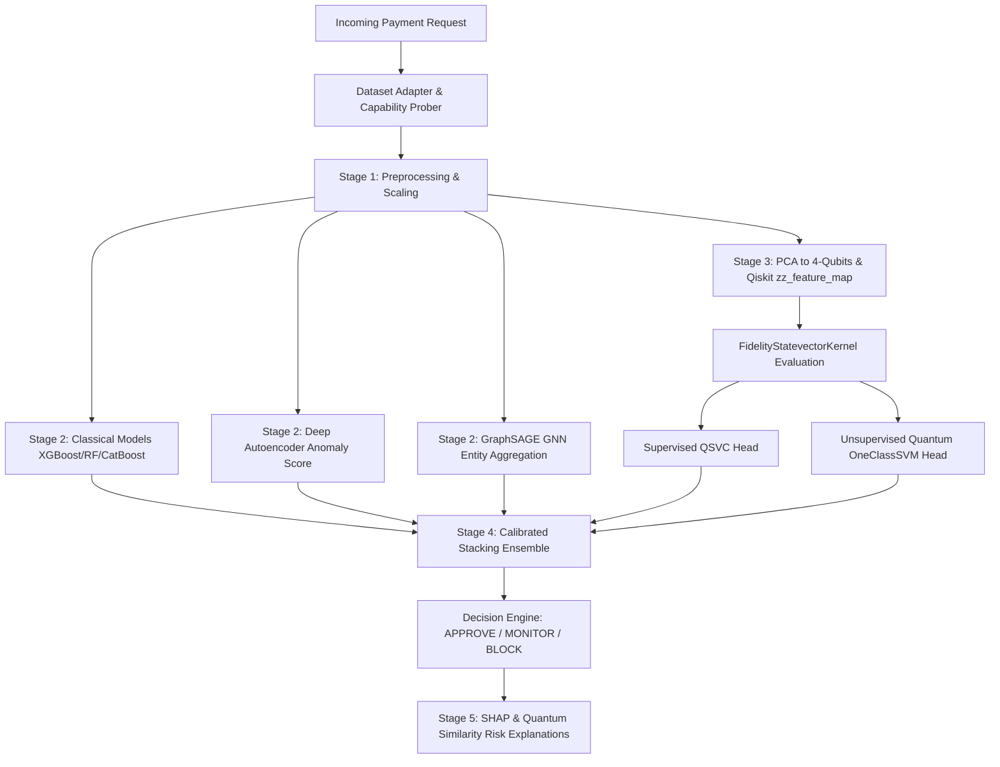

# System Architecture — Q-FraudShield

## System Overview
Q-FraudShield combines Classical Machine Learning, Deep Autoencoders, Graph Intelligence, and Qiskit 2.x Quantum Kernel Feature Representations to provide real-time payment fraud detection.

## Core Modules
1. **Dataset Adapter**: Auto-detects schema targets (`label`/`Class`/`is_fraud`), handles time-ordered & stratified splits with zero data leakage.
2. **Classical Models**: XGBoost, LightGBM, CatBoost, Random Forest, Logistic Regression.
3. **Deep Learning**: PyTorch Tabular Autoencoder trained strictly on legitimate transactions ($y=0$) for anomaly detection.
4. **Graph Intelligence**: 2-layer GraphSAGE aggregating entity relationships (User, Device, Merchant, IP).
5. **Quantum Engine**: Pluggable `zz_feature_map` (Qiskit 2.x API), `FidelityStatevectorKernel`, QSVC, and OneClassSVM.
6. **Stacking Ensemble**: Logistic regression meta-learner with Isotonic probability calibration and risk thresholding.
