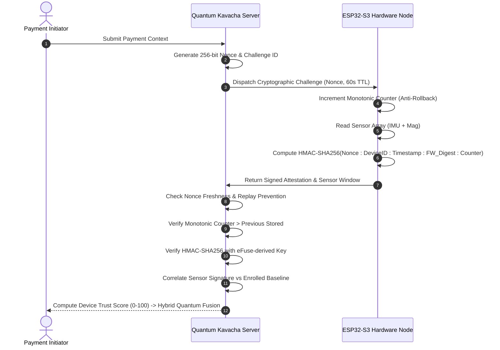

# QUANTUM KAVACHA — HARDWARE TRUST NODE ARCHITECTURE & DEPLOYMENT GUIDE

## 1. System Overview

The **Quantum Kavacha Hardware Trust Node** is a physical microcontroller node based on the **ESP32-S3** (Xtensa LX7 Dual-Core 240MHz). It serves as a hardware-rooted device identity, multi-axis physical sensor telemetry, and cryptographic challenge-response attestation layer.

```
+-----------------------------------------------------------------------------------+
|                        QUANTUM KAVACHA HARDWARE TRUST NODE                        |
|                                                                                   |
|  +-----------------------+     +------------------------+     +----------------+  |
|  |       ESP32-S3        |     |  MPU6050 (6-Axis IMU)  |     | QMC5883L (Mag) |  |
|  |  Dual Xtensa LX7 Core |<--->|  Accel: +/- 2g         |<--->| 3-Axis Field   |  |
|  |  eFuse Hardware Root  | I2C |  Gyro: +/- 250 deg/s   | I2C | Heading Vector |  |
|  +-----------------------+     +------------------------+     +----------------+  |
|              |                                                        |           |
|              +---------------- Wi-Fi 802.11 b/g/n -------------------+           |
+-----------------------------------------------------------------------------------+
                                       |
                                       v [JSON / HMAC-SHA256 Signed Telemetry]
+-----------------------------------------------------------------------------------+
|                       QUANTUM KAVACHA BACKEND RISK ENGINE                         |
|                                                                                   |
|  1. Nonce Challenge Generation (256-bit cryptographically secure token)           |
|  2. Anti-Replay Defense (consumed nonce tracking, 60s TTL freshness window)       |
|  3. Monotonic Counter Verification (Hardware anti-rollback protection)            |
|  4. Sensor Baseline Correlation (Cosine similarity & variance displacement)       |
|  5. Device Trust Scoring (25% ID, 25% Attestation, 15% FW, 15% IMU, 10% Timing)   |
|  6. Hybrid Quantum Escalation (4-Qubit ZZFeatureMap Kernel for Borderline Cases)   |
+-----------------------------------------------------------------------------------+
```

---

## 2. Hardware Pinout & Wiring

| Component | ESP32-S3 Pin | Sensor Pin | Protocol | Description |
| :--- | :--- | :--- | :--- | :--- |
| **MPU6050** | `3V3` | `VCC` | Power | 3.3V DC Regulated Power |
| **MPU6050** | `GND` | `GND` | Ground | System Common Ground |
| **MPU6050** | `GPIO 21` | `SDA` | I2C Data | 400kHz Fast I2C Bus |
| **MPU6050** | `GPIO 22` | `SCL` | I2C Clock | 400kHz Fast I2C Bus |
| **QMC5883L** | `GPIO 21` | `SDA` | I2C Data | Shared I2C Bus (Address `0x0D`) |
| **QMC5883L** | `GPIO 22` | `SCL` | I2C Clock | Shared I2C Bus (Address `0x0D`) |
| **BME280** (Opt)| `GPIO 21` | `SDA` | I2C Data | Shared I2C Bus (Address `0x76`) |
| **BME280** (Opt)| `GPIO 22` | `SCL` | I2C Clock | Shared I2C Bus (Address `0x76`) |

---

## 3. Cryptographic Attestation Protocol



---

## 4. Development vs Production Hardening Modes

> [!CAUTION]
> **IRREVERSIBLE EFUSE OPERATIONS WARNING**:
> Burning production eFuses permanently disables JTAG debugging and locks flash encryption keys.
> **Never burn production eFuses on general development boards.**

### Mode A: Demo / Simulation Mode (Default)
- Uses software-simulated eFuse HMAC keys and simulated Secure Boot status.
- Safe for standard development and hackathon demonstrations.
- Full API compatibility without risk of bricking hardware.

### Mode B: Production Hardened Mode (Field Deployment)
- `espefuse.py -p COMx burn_key BLOCK3 my_hmac_key.bin HMAC_UP`
- Enables Secure Boot v2 with RSA-3072 signing key.
- Enables Flash Encryption (AES-256-XTS).
- Restricts UART ROM download mode.

---

## 5. Firmware Flashing Instructions

```bash
# 1. Install PlatformIO Core
pip install platformio

# 2. Navigate to firmware directory
cd firmware/esp32_s3_trust_node

# 3. Compile and flash firmware to connected ESP32-S3
pio run --target upload

# 4. Open Serial Monitor at 115200 baud
pio device monitor -b 115200
```
